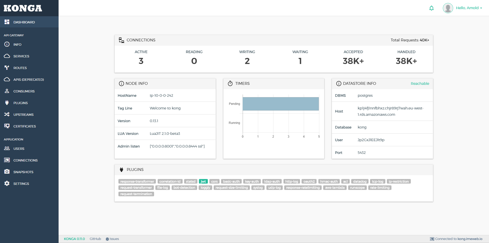

## Summary

To spin up SurveyDonkey infrastructure,

```shell
docker-compose up
```

This will start

- Kong

  - a PostgreSQL container
  - a Kong server container
  - a Konga server container
  - necessary database migrations

- Jenkins: with git and make installed

- SonarQube

- WebhookRelay: to allow application on internet (e.g. Github) send message to SurveyDonkey local containers (e.g. http://loalhost:8080) inside an intranet



To restart all containers,

```shell
docker-compose restart
```

To remove all containers,

```shell
docker-compose down
```

To restart a container, e.g. konga

```shell
docker-compose restart konga
```

To set up Webhookrelay deliverying Github message to Jenkins, put the destination url as `http://jenkins:8080`
